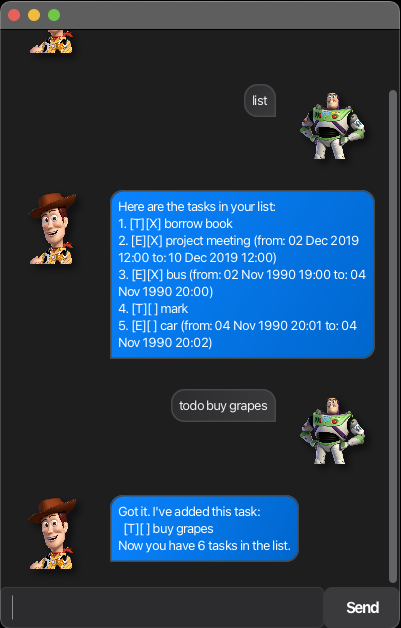

# Woody

Woody is a JavaFX-based task management chatbot built for fast, text-driven personal planning.  
It supports core task workflows across todos, deadlines, and events, with persistent local storage and a clean conversational interface.



## Overview

The project is structured around clear separation of concerns:
- parsing and input validation
- domain task models and list management
- storage and file persistence
- UI rendering and interaction flow

This keeps feature logic focused, testable, and easy to extend.

## Technical Highlights

- `Java 17` + `JavaFX` desktop GUI
- Gradle-based build and packaging
- Persistent storage at `data/woody.txt`
- Error handling with applicaiton-specific exceptions
- Modular package design for maintainability

## Project Structure

```text
src/
├─ main/
│  ├─ java/
│  │  └─ woody/
│  │     ├─ parser/      # Input parsing and syntax handling
│  │     ├─ storage/     # Local file read/write logic
│  │     ├─ task/        # Task models and task list behavior
│  │     ├─ ui/          # JavaFX UI and presentation flow
│  │     └─ exception/   # Application-specific exception types
│  └─ resources/
│     ├─ view/           # FXML layouts
│     ├─ css/            # UI styling
│     └─ images/         # UI assets
└─ test/
   └─ java/
      └─ woody/
         ├─ task/        # Task and task-list tests
         └─ parser/      # Parser tests
```

## Build and Run

```bash
./gradlew run
./gradlew test
./gradlew shadowJar
```

The packaged executable is generated at `build/libs/woody.jar`.

## Documentation

- User guide: `docs/README.md`
- Developer notes: `AI.md`
