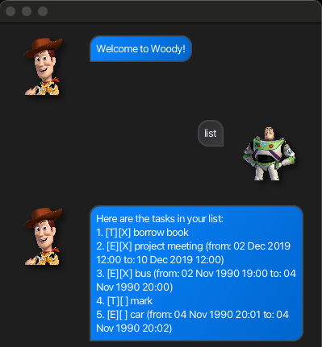
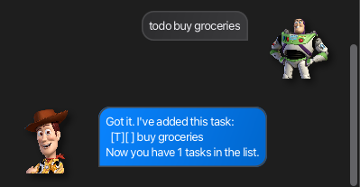
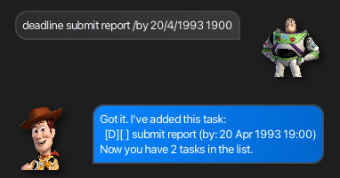
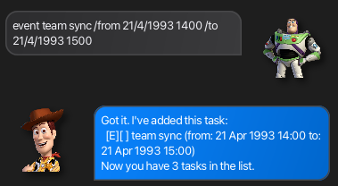
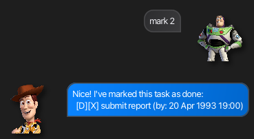
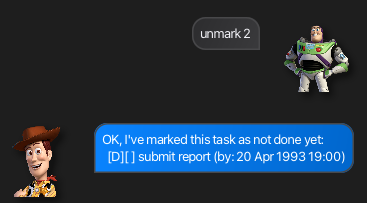
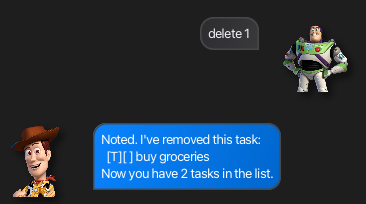
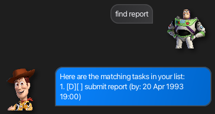

# Woody User Guide

Woody is a lightweight task manager that helps you track todos, deadlines, and events.
You interact with it using short commands and get responses in a chat-style interface.

---

## Table of contents

- [Quick start](#quick-start)
- [Data storage](#data-storage)
- [Command summary](#command-summary)
- [Features](#features)
  - [Listing tasks: `list`](#listing-tasks)
  - [Adding a todo: `todo`](#adding-a-todo)
  - [Adding a deadline: `deadline`](#adding-a-deadline)
  - [Adding an event: `event`](#adding-an-event)
  - [Marking a task: `mark`](#marking-a-task)
  - [Unmarking a task: `unmark`](#unmarking-a-task)
  - [Deleting a task: `delete`](#deleting-a-task)
  - [Finding tasks: `find`](#finding-tasks)
  - [Exiting the app: `bye`](#exiting)

---

## Quick start

1. Prerequisites: ensure you have Java 17 or above installed.
   ```
   java -version
   ```
2. Download the latest `woody.jar` from [here](https://github.com/choppyback/ip/releases).
3. Run the app:
   ```
   java -jar woody.jar
   ```
4. Start managing tasks:
   ```
   todo buy grapes
   deadline report /by 20/4/1993 1900
   list
   ```
---

## Data storage

Woody saves tasks to `data/woody.txt` (relative to where you run the app) upon 'bye' command.

If the file does not exist, Woody creates it on first save.
When Woody starts, it loads existing tasks from this same file.
---

## Command summary

| Command | What it does |
| --- | --- |
| `list` | Shows all tasks. |
| `todo <description>` | Adds a todo. |
| `deadline <description> /by <date/time>` | Adds a deadline. |
| `event <description> /from <start> /to <end>` | Adds an event. |
| `mark <index>` | Marks a task as done. |
| `unmark <index>` | Marks a task as not done. |
| `delete <index>` | Removes a task. |
| `find <keyword>` | Lists tasks that contain the keyword. |
| `bye` | Exits the app. |

---

## Features

### Listing tasks

Format: `list`

Expected outcome:
```
Here are the tasks in your list:
1. [T][ ] buy groceries
2. [D][X] submit report (by: 20 Apr 1993 19:00)
```

Example output screenshot:



### Adding a todo

Format: `todo <description>`

Example: `todo buy groceries`

Expected outcome:
```
Got it. I've added this task:
  [T][ ] buy groceries
Now you have 1 tasks in the list.
```

Example output screenshot:


### Adding a deadline

Use this when you need a task that must be completed by a specific time.

Format: `deadline <description> /by <date/time>`

Example: `deadline submit report /by 20/4/1993 1900`

Expected outcome:
```
Got it. I've added this task:
  [D][ ] submit report (by: 20 Apr 1993 19:00)
Now you have 1 tasks in the list.
```

Example output screenshot:


### Adding an event

Format: `event <description> /from <start> /to <end>`

Example: `event team sync /from 21/4/1993 1400 /to 21/4/1993 1500`

Expected outcome:
```
Got it. I've added this task:
  [E][ ] team sync (from: 21 Apr 1993 14:00 to: 21 Apr 1993 15:00)
Now you have 1 tasks in the list.
```

Example output screenshot:


### Marking a task

Format: `mark <index>`

Example: `mark 2`

Expected outcome:
```
Nice! I've marked this task as done:
  [D][X] submit report (by: 20 Apr 1993 19:00)
```

Example output screenshot:


### Unmarking a task

Format: `unmark <index>`

Example: `unmark 2`

Expected outcome:
```
OK, I've marked this task as not done yet:
  [D][ ] submit report (by: 20 Apr 1993 19:00)
```

Example output screenshot:


### Deleting a task

Format: `delete <index>`

Example: `delete 1`

Expected outcome:
```
Noted. I've removed this task:
  [T][ ] buy groceries
Now you have 1 tasks in the list.
```

Example output screenshot:


### Finding tasks

Format: `find <keyword>`

Example: `find report`

Expected outcome:
```
Here are the matching tasks in your list:
1. [D][ ] submit report (by: 20 Apr 1993 19:00)
```

Example output screenshot:


### Exiting

Format: `bye`

Expected outcome:
```
Bye. Hope to see you again soon!
```

Example output screenshot:


---

## FAQ
